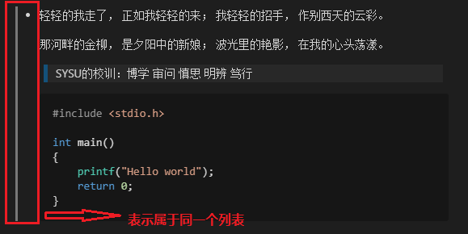

# **Markdown语法整理**

# **目 录**
### [-1. 注 意 事 项](#-1.-注意事项)
### [0. 特 别 感 谢](#0.-特别感谢)
### [1. 字 体 样 式](#1.-字体样式)
### [2. 分 级 标 题](#2.-分级标题)
### [3. 链 接](#3.-链接)
### [4. 列 表](#4.-列表)
### [5. 引 用](#5.-引用)
### [6. 图 像](#6.-图像)
### [7. 表 格](#7.-表格)
### [8. 代 码](#8.-代码块)
### [9. 公 式](#9.-公式(LaTeX))
### [10. 分 隔 线](#10.-分隔线)


## -1. 注意事项
- 以下内容均可在VS Code（1.39.2）正常运行，但不保证在其他阅读器上能够运行（如“锚点”）。
- 如果您在阅读中有发现任何错误，欢迎将问题发送到我的邮箱（<546035409@qq.com>），我会及时处理并修改，谢谢！
- 可以转载，但请保留[源出处](https://github.com/Passionzq)，谢谢！


## 0. 特别感谢
本文的内容整合自以下博主的帖子，有所删改：
- [Markdown数学公式语法](https://www.jianshu.com/p/e74eb43960a1) by [DanielGavin](https://www.jianshu.com/u/b9e39a7a27ac)
- [Markdown 语法手册 （完整整理版）](https://cloud.tencent.com/developer/article/1024105) by [陌晴](https://cloud.tencent.com/developer/user/1002631)
- [CSDN-Markdown添加代码段（标识符）](https://blog.csdn.net/qq_35451572/article/details/85125737) by [泉伟](https://blog.csdn.net/qq_35451572)


## 1. 字体样式

### 1.1 代码：
```
*斜体*
        
**粗体** 
        
***加粗斜体*** 
        
~~删除线~~ 
```

### 1.2 效果：
- *斜体*或_斜体_ 
- **粗体** 
- ***加粗斜体*** 
- ~~删除线~~ 


## 2. 分级标题
### 2.1 代码：
- 方法一：
    ```
    一级标题
    ===
    二级标题
    ---
    ```
- 方法二：
    ```
    # 一级标题
    ## 二级标题
    ### 三级标题
    #### 四级标题
    ```

### 2.2 效果：
一级标题（方法一）
===
二级标题（方法一）
---
# 一级标题（方法二）
## 二级标题（方法二）
### 三级标题（方法二）
#### 四级标题（方法二）


## 3. 链接
**注意：** 后文中的的url应当是`https://xxx`类型的网站，而非`www.xxx`类型。如果是本地
### 3.1 代码：
- 行内式：用的比较多的一种方式。
  ```
  [word](url/local_path title="")
  //title属性的效果是鼠标悬停在链接上会出现指定的title文字，可以不加。

  感谢访问[我的主页](https://github.com/Passionzq) 

  感谢访问[我的主页](https://github.com/Passionzq "Passionzq") 
  ```

- 参考式：如果某一个链接在文章中多处使用，那么使用引用 的方式创建链接将非常好，它可以让你对链接进行统一的管理。
  ```
  [word][tag]
  [tag]:url/local_path title=""

  我常用的搜索引擎有[Google][1], [Bing][2],如果可以的话我不太愿意使用[Baidu][3]。但结合实际情况，我用的最多的还是[Bing][2]。如果你觉得这篇[文章][]有问题，可以发邮件告诉我。

  [1]:google.com "Google"
  [2]:cn.bing.com "Bing"
  [3]:baidu.com "Baidu"
  [文章]:https://github.com/Passionzq/code-process/blob/master/Markdown.md
  ```
- 自动连接：Markdown 支持以比较简短的自动链接形式来处理网址和电子邮件信箱，只要是用<>包起来， Markdown 就会自动把它转成链接。一般网址的链接文字就和链接地址一样。
  ```
  <https://github.com/Passionzq> 

  <546035409@qq.com> 
  ```

- 锚点：可以实现页面内的**跳转到标题**。
  ```
  [src_word](#dst_title)
  //注：如果标题中有空格，使用 - 替代.

  跳转到[目录](#目-录)
  ```

### 3.2 效果：
- 行内式：
  - 感谢访问[我的主页](https://github.com/Passionzq) 
  - 感谢访问[我的主页](https://github.com/Passionzq "Passionzq") 
  
- 参考式：
  
    我常用的搜索引擎有[Google][1], [Bing][2],如果可以的话我不太愿意使用[Baidu][3]。但结合实际情况，我用的最多的还是[Bing][2]。如果你觉得这篇[文章][]有问题，可以发邮件告诉我。

    [1]:https://google.com "Google"
    [2]:https://cn.bing.com "Bing"
    [3]:https://baidu.com "Baidu"
    [文章]:https://github.com/Passionzq/code-process/blob/master/Markdown.md

- 自动链接:
  
    <https://github.com/Passionzq> 

    <546035409@qq.com> 

- 锚点：
  
    跳转到[目录](#目-录)

## 4. 列表
### 4.1 代码：
- 无序列表：使用 *，+，- 表示无序列表。 
  ```
  * 无序列表 *
  + 无序列表 +
  - 无序列表 -
  ```

- 有序列表：使用数字接着一个**英文**句点。
  ```
  1. 有序列表1.
  2. 有序列表2.
  3. 有序列表3.
  ```

- 包含多个内容的列表：列表项目可以包含多个内容（文字段落、引用、代码块等），这些内容必须缩进 4 个空格或是 1 个制表符来表示是属于当前段落.
  ```
  - 轻轻的我走了， 正如我轻轻的来； 我轻轻的招手， 作别西天的云彩。
   
      那河畔的金柳， 是夕阳中的新娘； 波光里的艳影， 在我的心头荡漾。
      
      SYSU的校训:
      
        > 博学 审问 慎思 明辨 笃行
      ```cpp
      #include <stdio.h>

      int main()
      {
          printf("Hello world");
          return 0;
      }
      ```
  ```
  
- 特殊情况：有些时候希望单纯地显示像这样的文本`1997. 香港回归`，但是却被误判为**有序列表**，这时候可以在数字与英文句点之间加反斜杠。
  ```
  1997\. 香港回归
  ```

### 4.2 效果：
- 无序列表：
  * 无序列表 *
  + 无序列表 +
  - 无序列表 -

- 有序列表：
  1. 有序列表1.
  2. 有序列表2.
  3. 有序列表3.

- 包含段落的列表:
  

- 特殊情况：
  
    1997\. 香港回归

## 5. 引用
引用需要在被引用的文本前加上>符号。区块引用可以嵌套（例如：引用内的引用），只要根据层次加上不同数量的 > ：
### 5.1 代码：
```
> 一级引用 

>> 二级引用

>>> 三级引用
```

### 5.2 效果：
> 一级引用 

>> 二级引用

>>> 三级引用

## 6.图像
与[链接](#3.-链接)几乎一致，只是需要在[]前加一个 ! 即可让图片显示，此处不再赘述。

## 7. 表格
1. 不管是哪种方式，第一行为表头，第二行分隔表头和主体部分，第三行开始每一行为一个表格行。 	
2. 列于列之间用管道符|隔开。原生方式的表格每一行的两边也要有管道符。 	
3. 第二行还可以为不同的列指定对齐方向。**默认为左对齐**，第二行中的`-:` 为右对齐，`:-:`为中间对齐
   
### 代码：
- 原生方式：
  ```
  |姓 名|性 别|分 数|
  |-|-|-|
  |小明|男|99|
  |小红|女|99|
  ```

- 缩略版（右对齐）：
  ```
  姓 名|性 别|分 数
  -:|-:|-:
  小明|男|99
  小红|女|99
  ```

- 指定方向（中间对齐）：
  ```
  |姓 名|性 别|分 数|
  |:-:|:-:|:-:|
  |小明|男|99|
  |小红|女|99|
  ```

### 效果：
- 原生方式：
  |姓 名|性 别|分 数|
  |-|-|-|
  |小明|男|99|
  |小红|女|99|

- 缩略版：
  姓 名|性 别|分 数
  -:|-:|-:
  小明|男|99
  小红|女|99

- 指定方向（中间对齐）：
  |姓 名|性 别|分 数|
  |:-:|:-:|:-:|
  |小明|男|99|
  |小红|女|99|

## 8. 代码块
### 代码：
- 行内式：
  ```
  请问C++的`printf()`函数如何使用?
  ```

- 多行代码：
  ```
  ``cpp(此处应为三个 ` 或以上，但因为markdown无法嵌套，所以此处只打了两个)
  #include<iostream>
  
  int main()
  {
      printf("Hello world\n");
      return 0;
  }

  ``(同理，注意 ` 这个符号是esc下面的那个键)
  ```
### language_type：
如“多行代码”中所示，我们在三个 ` 之后接了一个cpp，这个是该段程序的**标识符**，会对标识符对应语言的关键字进行语法高亮，下面是一些常用语言的标识符：
|语 言|标 识 符|
|:--:|:------:|
|C/C++|c , cpp|
|Java|java|
|Python|py , python|
|PHP|php|
|Shell|bash,shell|
|C#|c# , c-sharp , csharp|
|CSS|css|
|JavaScript|js , jscript , javascript|
|text|text , plain|
|XML|xml , xhtml , xslt , html|
|R|r , s , splus|
|GO|go , golang|
|AppleScript|applescript|
|ActionScript 3.0|	actionscript3 , as3|
|ColdFusion	|coldfusion , cf|
|Delphi	|delphi , pascal , pas|
|diff&patch	|diff patch|
|Erlang	|erl , erlang|
|Groovy	|groovy|
|JavaFX	|jfx , javafx|
|Perl	|perl , pl , Perl|
|Ruby	|ruby , rails , ror , rb|
|SASS&SCSS|	sass , scss|
|Scala	|scala|
|SQL	|sql|
|Visual Basic|	vb , vbnet|
|Objective C|	objc , obj-c|
|F#	|f# f-sharp , fsharp|
|matlab	|matlab|
|swift	|swift|

### 效果：
- 行内式：
    请问C++的`printf()`函数如何使用?

- 多行代码：
  ```cpp
  #include<iostream>
  
  int main()
  {
      printf("Hello world\n");
      return 0;
  }
  ```

## 9. 公式(LaTeX)
### (1) 行内 vs 独行
- 行内公式：将公式插入到本行内，符号：\$公式内容\$，如：$xyz$
- 独行公式：(需要换行)将公式插入到新的一行内，并且居中，符号：\$\$公式内容\$\$,如：
$${16}_{8}O{2+}_{2}$$

### (2) 汉字、字体与格式
- 字体控制，符号：`\displaystyle`，如：$\displaystyle \frac{x+y}{y+z}$
- 下划线符号，符号：`\underline`，如：$\underline{x+y}$
- 上大括号，符号：`\overbrace{算式}`，如：$\overbrace{a+b+c+d}^{2.0}$
- 下大括号，符号：`\underbrace{算式}`，如：$a+\underbrace{b+c}_{1.0}+d$
- 上位符号，符号：`\stacrel{上位符号}{基位符号}`，如：$\vec{x}\stackrel{\mathrm{def}}{=}{x_1,\dots,x_n}$

### (3) 占位符
- 两个quad空格，符号：`\qquad`，如：$x \qquad y$
- quad空格，符号：`\quad`，如：$x \quad y$
- 大空格，符号`\`，如：$x \ y$
- 中空格，符号`\:`，如：$x \: y$
- 小空格，符号`\,`，如：$x \, y$
- 没有空格，符号``，如：$xy$
- 紧贴，符号`\!`，如：$x \! y$

### (4) 定界符与组合
- 括号，符号：`()` , `\big(\big)` , `\Big(\Big)`,  `\bigg(\bigg)`  , `\Bigg(\Bigg)`，如：$（）\big(\big) \Big(\Big) \bigg(\bigg) \Bigg(\Bigg)$
- 中括号，符号：`[]`，如：$[x+y]$
- 大括号，(注：大括号在`$$`中是关键字，如果需要显示大括号需要在符号前加转义符 ` \ `)符号：`\{ \}`，如：$\{x+y\}$
- 自适应括号，符号：`\left` `\right`，如：$\left(x\right)$，$\left(x{yz}\right)$
- 组合公式，符号：`{上位公式 \choose 下位公式}`，如：${n+1 \choose k}={n \choose k}+{n \choose k-1}$
- 组合公式，符号：`{上位公式 \atop 下位公式}`，如：$\sum_{k_0,k_1,\ldots>0 \atop k_0+k_1+\cdots=n}A_{k_0}A_{k_1}\cdots$

### (5) 四则运算
- 加法运算，符号：`+`，如：$x+y=z$
- 减法运算，符号：`-`，如：$x-y=z$
- 加减运算，符号：`\pm`，如：$x \pm y=z$
- 减甲运算，符号：`\mp`，如：$x \mp y=z$
- 乘法运算，符号：`\times`，如：$x \times y=z$
- 点乘运算，符号：`\cdot`，如：$x \cdot y=z$
- 星乘运算，符号：`\ast`，如：$x \ast y=z$
- 除法运算，符号：`\div`，如：$x \div y=z$
- 斜法运算，符号：`/`，如：$x/y=z$
- 分式表示，符号：`\frac{分子}{分母}`，如：$\frac{x+y}{y+z}$
- 分式表示，符号：`{分子} \voer {分母}`，如：${x+y} \over {y+z}$
- 绝对值表示，符号：`||`，如：$|x+y|$

### (6) 高级运算
- 平均数运算，符号：`\overline{算式}`，如：$\overline{xyz}$
- 开二次方运算，符号：`\sqrt`，如：$\sqrt x$
- 开方运算，符号：`\sqrt[开方数]{被开方数}`，如：$\sqrt[3]{x+y}$
- 对数运算，符号：`\log`，如：$\log(x)$
- 极限运算，符号：`\lim`，如：$\lim^{x \to \infty}_{y \to 0}{\frac{x}{y}}$
- 极限运算，符号：`\displaystyle \lim`，如：$\displaystyle \lim^{x \to \infty}_{y \to 0}{\frac{x}{y}}$
- 求和运算，符号：`\sum`，如：$\sum^{x \to \infty}_{y \to 0}{\frac{x}{y}}$
- 求和运算，符号：`\displaystyle \sum`，如：$\displaystyle \sum^{x \to \infty}_{y \to 0}{\frac{x}{y}}$
- 积分运算，符号：`\int`，如：$\int^{\infty}_{0}{xdx}$
- 积分运算，符号：`\displaystyle \int`，如：$\displaystyle \int^{\infty}_{0}{xdx}$
- 微分运算，符号：`\partial`，如：$\frac{\partial x}{\partial y}$
- 矩阵表示，符号：`\begin{matrix} \end{matrix}`，如：$\left[ \begin{matrix} 1 &2 &\cdots &4\5 &6 &\cdots &8\\vdots &\vdots &\ddots &\vdots\13 &14 &\cdots &16\end{matrix} \right]$


### (7) 逻辑运算
- 等于运算，符号：`=`，如：$x+y=z$
- 大于运算，符号：`>`，如：$x+y>z$
- 小于运算，符号：`<`，如：$x+y<z$
- 大于等于运算，符号：`\geq`，如：$x+y \geq z$
- 小于等于运算，符号：`\leq`，如：$x+y \leq z$
- 不等于运算，符号：`\neq`，如：$x+y \neq z$
- 不大于等于运算，符号：`\ngeq`，如：$x+y \ngeq z$
- 不大于等于运算，符号：`\not\geq`，如：$x+y \not\geq z$
- 不小于等于运算，符号：`\nleq`，如：$x+y \nleq z$
- 不小于等于运算，符号：`\not\leq`，如：$x+y \not\leq z$
- 约等于运算，符号：`\approx`，如：$x+y \approx z$
- 恒定等于运算，符号：`\equiv`，如：$x+y \equiv z$


### (7) 集合运算
- 属于运算，符号：`\in`，如：$x \in y$
- 不属于运算，符号：`\notin`，如：$x \notin y$
- 不属于运算，符号：`\not\in`，如：$x \not\in y$
- 子集运算，符号：`\subset`，如：$x \subset y$
- 子集运算，符号：`\supset`，如：$x \supset y$
- 真子集运算，符号：`\subseteq`，如：$x \subseteq y$
- 非真子集运算，符号：`\subsetneq`，如：$x \subsetneq y$
- 真子集运算，符号：`\supseteq`，如：$x \supseteq y$
- 非真子集运算，符号：`\supsetneq`，如：$x \supsetneq y$
- 非子集运算，符号：`\not\subset`，如：$x \not\subset y$
- 非子集运算，符号：`\not\supset`，如：$x \not\supset y$
- 并集运算，符号：`\cup`，如：$x \cup y$
- 交集运算，符号：`\cap`，如：$x \cap y$
- 差集运算，符号：`\setminus`，如：$x \setminus y$
- 同或运算，符号：`\bigodot`，如：$x \bigodot y$
- 同与运算，符号：`\bigotimes`，如：$x \bigotimes y$
- 实数集合，符号：`\mathbb{R}`，如：\mathbb{R}
- 自然数集合，符号：`\mathbb{Z}`，如：\mathbb{Z}
- 空集，符号：`\emptyset`，如：$\emptyset$


### (8) 数学符号
- 无穷，符号：`\infty`，如：$\infty$
- 虚数，符号：`\imath`，如：$\imath$
- 虚数，符号：`\jmath`，如：$\jmath$
- 数学符号，符号`\hat{a}`，如：$\hat{a}$
- 数学符号，符号`\check{a}`，如：$\check{a}$
- 数学符号，符号`\breve{a}`，如：$\breve{a}$
- 数学符号，符号`\tilde{a}`，如：$\tilde{a}$
- 数学符号，符号`\bar{a}`，如：$\bar{a}$
- 矢量符号，符号`\vec{a}`，如：$\vec{a}$
- 数学符号，符号`\acute{a}`，如：$\acute{a}$
- 数学符号，符号`\grave{a}`，如：$\grave{a}$
- 数学符号，符号`\mathring{a}`，如：$\mathring{a}$
- 一阶导数符号，符号`\dot{a}`，如：$\dot{a}$
- 二阶导数符号，符号`\ddot{a}`，如：$\ddot{a}$
- 上箭头，符号：`\uparrow`，如：$\uparrow$
- 上箭头，符号：`\Uparrow`，如：$\Uparrow$
- 下箭头，符号：`\downarrow`，如：$\downarrow$
- 下箭头，符号：`\Downarrow`，如：$\Downarrow$
- 左箭头，符号：`\leftarrow`，如：$\leftarrow$
- 左箭头，符号：`\Leftarrow`，如：$\Leftarrow$
- 右箭头，符号：`\rightarrow`，如：$\rightarrow$
- 右箭头，符号：`\Rightarrow`，如：$\Rightarrow$
- 底端对齐的省略号，符号：`\ldots`，如：$1,2,\ldots,n$
- 中线对齐的省略号，符号：`\cdots`，如：$x_1^2 + x_2^2 + \cdots + x_n^2$
- 竖直对齐的省略号，符号：`\vdots`，如：$\vdots$
- 斜对齐的省略号，符号：`\ddots`，如：$\ddots$

### (9) 希腊字母
|字 母|实 现|字 母|实 现|
|:--:|:---:|:---:|:---:|
|A	|A	|α|	\alhpa|
|B	|B	|β|	\beta|
|Γ	|\Gamma	|γ|	\gamma|
|Δ	|\Delta	|δ|	\delta|
|E	|E	|ϵ|	\epsilon|
|Z	|Z	|ζ|	\zeta|
|H	|H	|η|	\eta|
|Θ	|\Theta	|θ|	\theta|
|I	|I	|ι|	\iota|
|K	|K	|κ|	\kappa|
|Λ	|\Lambda	|λ|	\lambda|
|M	|M	|μ|	\mu|
|N	|N	|ν|	\nu|
|Ξ	|\Xi	|ξ|	\xi|
|O	|O	|ο|	\omicron|
|Π	|\Pi	|π|	\pi|
|P	|P	|ρ|	\rho|
|Σ	|\Sigma	|σ|	\sigma|
|T	|T	|τ|	\tau|
|Υ	|\Upsilon	|υ|	\upsilon|
|Φ	|\Phi	|ϕ|	\phi|
|X	|X	|χ|	\chi|
|Ψ	|\Psi	|ψ|	\psi|
|Ω	|\v	|ω|	\omega|


## 10. 分隔线
可以在一行中用三个以上的星号、减号、底线来建立一个分隔线，行内不能有其他东西。你也可以在星号或是减号中间插入空格。下面每种写法都可以建立分隔线： 
### 代码：
```
* * * 

*** 

***** 

- - - 

--------------------------------------- 
```
### 效果：
上述效果都一样，此处只列举一种：
***
